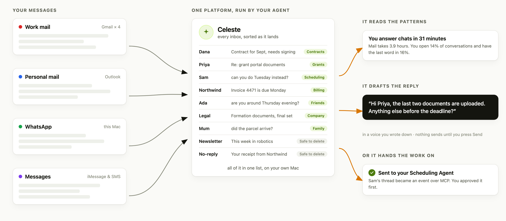
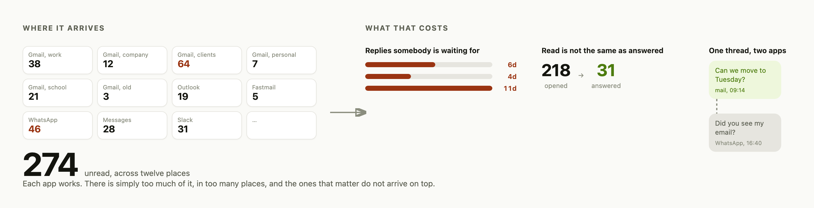
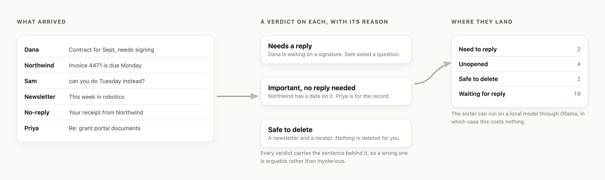
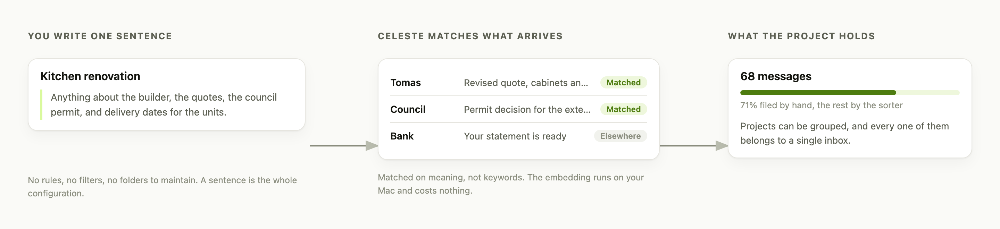
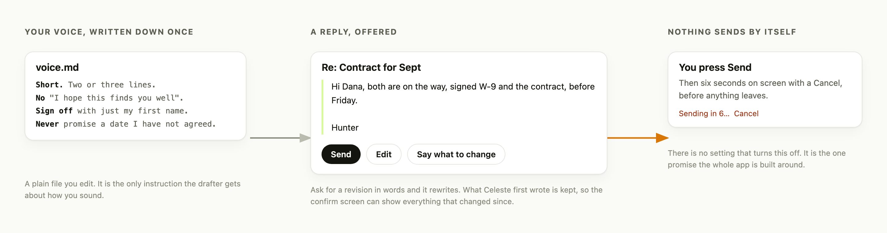
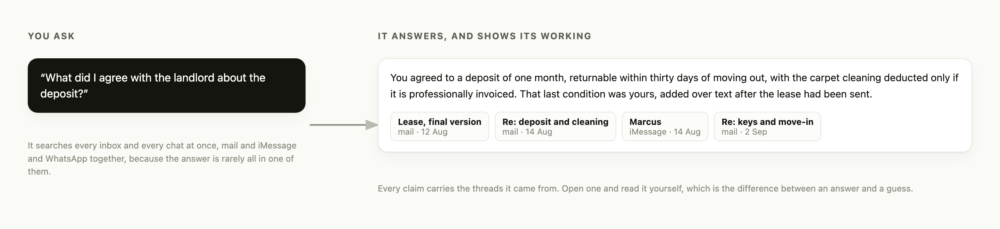
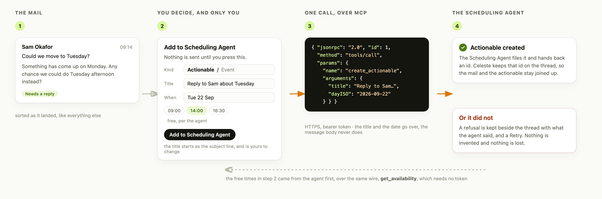
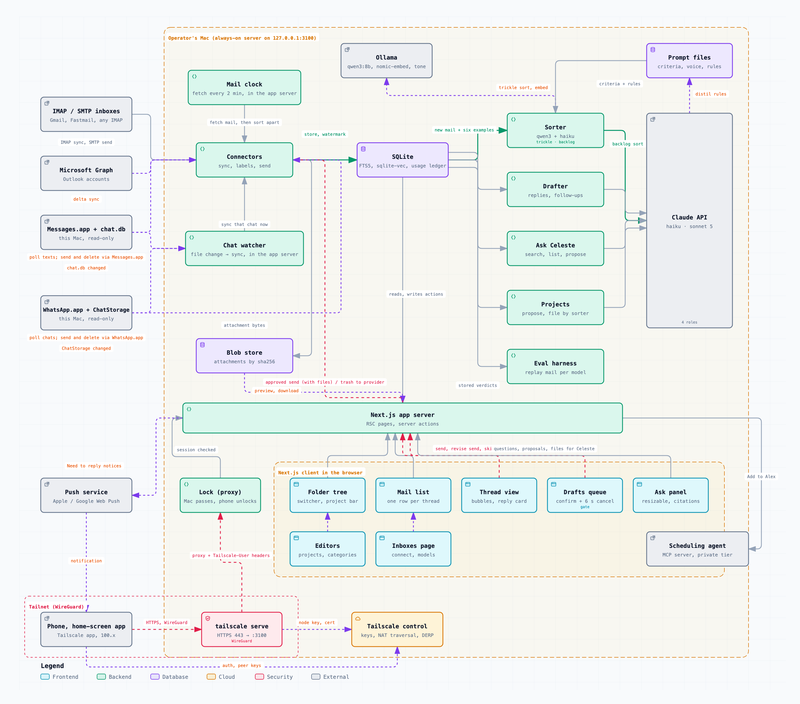

# Celeste

- An all-in-one mail and messages system, governed by an agent, that runs locally on your own Mac and drafts messages on your behalf
- For actionable emails, it creates an actionable in my schedule through my [Scheduling Agent](https://github.com/hunterZh37/agentic-scheduling)

<picture>
  <source media="(prefers-color-scheme: dark)" srcset="website/assets/flow-dark.png">
  
</picture>

## Motivation

- I get a lot of messages from a lot of places: nearly ten Gmail accounts, WhatsApp, Messages, Slack
- My clients are spread across all of them, so it was easy to miss something that mattered, or to mean to reply and never get back to it
- I wanted one place that pulls the sources together, and to check all of them in one go like a todo list
- One place turned out to be overwhelming on its own. Several ways of cutting it down were tried. The one that stuck was **projects**. I describe a project in a sentence, and messages get filed under the one they match
- I was already pasting drafts into Claude to catch my grammar before sending, so it seemed worth putting that where the mail already was
- Free if you use open-source models

<picture>
  <source media="(prefers-color-scheme: dark)" srcset="website/assets/motivation-dark.png">
  
</picture>

> Slack is in that list because it is in my life, not because Celeste reads it.
> Today it covers mail over IMAP and Outlook, plus iMessage and WhatsApp.

## What it does

- **Reads Messages & Emails.** iMessage and WhatsApp, from the databases their desktop apps already keep. Read-only for history. Replies go out through the apps
- **Sorts.** Important or not, needs a reply or not, safe to delete or not. Can run on a local model through Ollama, for nothing
- **Files.** Describe a project in plain words. Messages are embedded locally and filed under the one they match
- **Drafts.** A reply in your voice, from a `voice.md` you write. Nothing sends until you press Send
- **Answers questions.** Ask Celeste searches every inbox and cites the threads
- **Hands off work.** A thread becomes an actionable or a calendar event in the [Scheduling Agent](https://github.com/hunterZh37/agentic-scheduling), over MCP. See [docs/SCHEDULING.md](docs/SCHEDULING.md)
- **Shows your patterns.** A stats page: reply times, who you keep waiting, how your own writing reads month by month

### Sorting

<picture>
  <source media="(prefers-color-scheme: dark)" srcset="website/assets/sorting-dark.png">
  
</picture>

### Projects

<picture>
  <source media="(prefers-color-scheme: dark)" srcset="website/assets/projects-dark.png">
  
</picture>

### Drafting, and the gate in front of it

<picture>
  <source media="(prefers-color-scheme: dark)" srcset="website/assets/drafting-dark.png">
  
</picture>

### Ask Celeste

<picture>
  <source media="(prefers-color-scheme: dark)" srcset="website/assets/ask-dark.png">
  
</picture>

### Stats

<picture>
  <source media="(prefers-color-scheme: dark)" srcset="website/assets/stats-dark.png">
  
</picture>

- **When you write.** Every hour, every weekday, every month, yours against theirs
- **How fast you answer.** The middle wait per source, never the average, which one holiday would own
- **How each one goes.** Who out-waits whom, who writes more, and which threads are going quiet
- **How your writing reads.** Month by month, on a local model, for nothing
- **A personality type you can argue with.** Declared, then tested over five runs, with the message each axis cites checked against the message it quotes
- Counts, not conclusions. Every figure can be checked against the database underneath it

## Handing a mail to the [Scheduling Agent](https://github.com/hunterZh37/agentic-scheduling)

<picture>
  <source media="(prefers-color-scheme: dark)" srcset="website/assets/handover-dark.png">
  
</picture>

- Nothing goes until you press **Add to Scheduling Agent**. The form is the gate
- The free times are fetched from the [Scheduling Agent](https://github.com/hunterZh37/agentic-scheduling) first, through `get_availability`
- The title starts as the subject line and is yours to change
- The title and the date go over. The message body never does
- A refusal is kept beside the thread with what the [Scheduling Agent](https://github.com/hunterZh37/agentic-scheduling) said, and a Retry
- Mechanics in [docs/SCHEDULING.md](docs/SCHEDULING.md)

## How it fits together

<picture>
  <source media="(prefers-color-scheme: dark)" srcset="docs/diagrams/system-architecture-dark.png">
  
</picture>

- Everything inside the dashed box is one Mac
- The only arrows leaving it: your mail providers, the model you chose, your own phone over the tailnet
- Open the rendered [HTML](docs/diagrams/system-architecture.html) locally for notes on each part that do not fit in a picture
- The diagram is generated from [`system-architecture.json`](docs/diagrams/system-architecture.json), not drawn. A change that adds a component edits it in the same commit:

```bash
node ~/.claude/skills/archify/bin/archify.mjs deliver architecture \
  docs/diagrams/system-architecture.json docs/diagrams/system-architecture.html \
  --quality showcase
```

## Requirements

- **macOS**. Chats read Apple and WhatsApp databases, and the service is a LaunchAgent
- **Node 22+** and **pnpm**
- An **Anthropic API key**, unless you run every role locally
- **[Ollama](https://ollama.com)** for project filing: `ollama pull nomic-embed-text`

## Getting started

```bash
git clone <this repo> && cd messaging-agent
pnpm install
cp .env.example .env    # then fill it in; it explains every value
pnpm web                # http://127.0.0.1:3100
```

- Open **Inboxes** and connect an account
- Gmail and IMAP need an OAuth client or an app password. Outlook.com needs an Azure app id. Both are in `.env.example`
- The first sync pulls a recent window and sorts it
- Everything lands in `~/messaging-agent`, or wherever `MESSAGING_AGENT_DATA_DIR` says

### As a background service

```bash
bash scripts/celeste-server/install.sh   # LaunchAgent, restarts on login
bash scripts/celeste-server/status.sh
```

- Binds to `127.0.0.1` only
- For your phone, put it on a private network. [Tailscale](https://tailscale.com) with `tailscale serve` is what this was built against
- `CELESTE_PASSCODE` is what the phone types once
- iMessage and WhatsApp need **Full Disk Access** (System Settings → Privacy & Security) and both apps signed in

## Layout

| Path | What |
|---|---|
| `packages/core` | Everything with no UI: connectors, sorting, drafting, projects, search, the database |
| `apps/web` | The Next.js app, the only interface you actually use |
| `apps/cli` | A thin CLI over the same core, for one-off runs |
| `docs/diagrams` | Architecture diagrams, rendered from JSON |
| `docs/superpowers/specs` | The design document, where the reasoning lives |

```bash
pnpm test        # every package
pnpm typecheck
```

- `pnpm test` also fails on a real email address or phone number in any tracked file
- A `commit-msg` hook does the same for commit messages. Turn it on with `git config core.hooksPath .githooks`
- Fixtures use `@example.com` and the reserved `555` exchange
- This app is developed against its author's own mailbox, so the handiest example is always a real person

## What it costs

- **Sorting** runs on everything, and can be entirely local and free
- **Drafting** and **Ask** are on demand, against the Anthropic API
- **Embeddings** and the **stats readings** are local and free
- Every call is itemised in the app under **Usage**

## Privacy

- Mail is stored unencrypted in SQLite on your machine, exactly as safe as your Mac is
- Message text reaches a model only when you sort, draft or ask
- Blocked senders are never stored and never reach a model
- Loopback only. No telemetry, no analytics, no phone-home

## Contributing

- Released as-is. Issues and pull requests welcome, may go unanswered, no support promise
- [CONTRIBUTING.md](CONTRIBUTING.md), what to run and what makes a change easy to accept
- [SECURITY.md](SECURITY.md), what it touches, how it is meant to be exposed, and how to report a problem privately. Please do not open a public issue for one

## License

MIT. See [LICENSE](LICENSE). By taking part you agree to the
[Code of Conduct](CODE_OF_CONDUCT.md).
